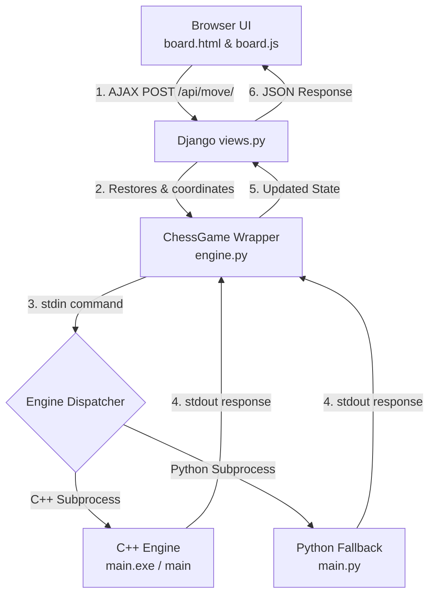

# ✨ Checkora Feature Guide

Welcome to the **Checkora Feature Guide**! Whether you are a first-time player exploring the platform, an aspiring developer looking to contribute, or a chess enthusiast curious about how a modern web-based chess engine works, this guide is designed for you.

Checkora is an open-source, hybrid-engine chess platform that combines a modern web interface with a high-performance chess engine. Below, we break down the setup process, architecture, and user interface features.

---

# 🚀 Introduction & Getting Started

### What is Checkora?
Checkora is an interactive chess platform that allows users to play chess online. It features two main play modes: **Pass & Play (PvP)** for two players sharing a screen, and **Play vs AI (PvE)** to challenge a built-in computer opponent. It also offers a **Daily Puzzle** section to test and build tactical skills. 

Checkora uses a **hybrid chess engine** strategy:
1. 🚀 **Primary Engine (C++17)**: A highly optimized compiled C++ engine that performs deep search calculations quickly.
2. 🐍 **Fallback Engine (Python 3.12+)**: An identical structural replica of the C++ engine. If the deployment server or local environment lacks permissions or compilation capabilities for C++, the system automatically degrades gracefully to Python so that gameplay is never interrupted.

### Who is this guide for?
- **First-Time Users**: Learn how to launch Checkora, start a game, select time controls, and customize settings.
- **New Contributors / GSSoC Developers**: Gain a holistic view of the project's layout, data flow, and codebase logic before writing pull requests.

### Quick Start: Local Development Setup

To run Checkora on your local machine, follow these steps:

#### 1. Prerequisites
Ensure you have the following installed:
- **Python** (version 3.12 or higher)
- **Git** (latest version)
- **g++** compiler (version 11+, optional but highly recommended to run the faster C++ engine)

#### 2. Clone the Repository & Configure Virtual Environment
Fork the repository and clone it to your local machine:
```bash
git clone https://github.com/Checkora/Checkora.git
cd Checkora
```

Create and activate a Python virtual environment:
- **Windows (Command Prompt / PowerShell)**:
  ```bash
  python -m venv .venv
  .venv\Scripts\activate
  ```
- **macOS / Linux**:
  ```bash
  python -m venv .venv
  source .venv/bin/activate
  ```

#### 3. Install Dependencies & Setup Environment
Install the required packages:
```bash
pip install -r requirements.txt
```

Initialize your environment configuration file from the template:
- **Windows (PowerShell/CMD)**:
  ```bash
  copy .env.example .env
  ```
- **macOS / Linux**:
  ```bash
  cp .env.example .env
  ```

> [!NOTE]
> Open the new `.env` file to customize settings like the `SECRET_KEY`, or credentials for email verification and password resets if needed.

#### 4. Compile the C++ Chess Engine (Optional but Recommended)
Compile the engine source file so Checkora can run at maximum depth and speed:
- **Windows**:
  ```bash
  g++ -O2 -std=c++17 game/engine/main.cpp -o game/engine/main.exe
  ```
- **macOS / Linux**:
  ```bash
  g++ -O2 -std=c++17 game/engine/main.cpp -o game/engine/main
  chmod +x game/engine/main
  ```
*(If you skip this step, Checkora will automatically fall back to using `game/engine/main.py`.)*

#### 5. Apply Migrations & Start the Server
Apply database migrations to set up the SQLite database, and launch the development server:
```bash
python manage.py migrate
python manage.py runserver
```

Open your browser and navigate to the default local URL:
```text
http://127.0.0.1:8000/
```

---

# 🧠 Engine Architecture

The Checkora engine is responsible for all core chess mechanics, move generation, validation, and AI logic.

### 1. Board Serialization
The game board is represented in Python as an 8x8 array. To communicate with the engine, this board is serialized into a flat **64-character string**:
- Uppercase letters represent White pieces (`K`, `Q`, `R`, `B`, `N`, `P`).
- Lowercase letters represent Black pieces (`k`, `q`, `r`, `b`, `n`, `p`).
- Periods (`.`) represent empty squares.

### 2. Minimax Search
The AI "brain" uses the **Minimax Algorithm**, which recursively builds a tree of future positions up to a specified depth. 
- It assumes both sides play optimally: White tries to maximize the final position score, while Black tries to minimize it.
- **Search Depth**:
  - In PvE games, the AI search depth is configured based on difficulty settings: **Easy** (Depth 1), **Medium** (Depth 2), and **Hard** (Depth 3).
  - The C++ engine itself utilizes adaptive depth based on the phase of the game: **4 plies** for the opening/middlegame, **5 plies** when $\leq$ 12 pieces remain, and **6 plies** in endgames with $\leq$ 6 pieces. The Python fallback engine runs at a fixed depth of **3 plies** to maintain speed.

### 3. Alpha-Beta Pruning
To optimize search speed, the Minimax search utilizes **Alpha-Beta Pruning**. This technique skips evaluating branches in the move tree that are mathematically proven to be worse than paths already explored.
- The engine also employs a **move-ordering heuristic** (evaluating captures and pawn promotions first) to maximize pruning efficiency.

### 4. Board Evaluation Heuristic
A position is evaluated statically when the search reaches its leaf nodes:
- **Material Values**: Pawn = 100, Knight = 320, Bishop = 330, Rook = 500, Queen = 900, King = 20,000 centipawns.
- **Positional Values**: Detailed **Piece-Square Tables** weight pieces based on where they are on the board (e.g., controlling the center is encouraged, placing knights on the rim is penalized).
- **Check Bonus**: Add (+50) if the opponent's king is put in check, promoting active play.

### 5. Opening Book
For the first few moves of a game, the engine bypasses the expensive Minimax calculation by looking up positions in `game/engine/opening_book.json`. If the current position's FEN matches a book key, it picks a randomized theory move to add variety.

---

# 🏗️ Codebase & Project Topology

For new contributors opening the repository, here is how the core systems fit together:

### High-Level Architecture Map


### Important Files & Directory Walkthrough
- [core/](file:///c:/Users/soniy/Checkora/core): Contains Django settings, database configs, and global routing.
- [game/](file:///c:/Users/soniy/Checkora/game): The heart of the chess platform.
  - [engine/](file:///c:/Users/soniy/Checkora/game/engine): Houses the core engine implementations:
    - [main.cpp](file:///c:/Users/soniy/Checkora/game/engine/main.cpp): The high-performance C++ minimax engine.
    - [main.py](file:///c:/Users/soniy/Checkora/game/engine/main.py): The Python fallback engine.
    - [opening_book.json](file:///c:/Users/soniy/Checkora/game/engine/opening_book.json): JSON dictionary mapping standard opening sequences.
  - [static/game/js/board.js](file:///c:/Users/soniy/Checkora/game/static/game/js/board.js): Client-side JavaScript handling piece dragging, legal move highlighting, animations, sounds, and AJAX calls.
  - [templates/game/board.html](file:///c:/Users/soniy/Checkora/game/templates/game/board.html): HTML rendering the chessboard, sidebar, game logs, and menu cards.
  - [engine.py](file:///c:/Users/soniy/Checkora/game/engine.py): Contains the `ChessGame` class wrapper which manages serialization (e.g., FEN conversion) and spawns the engine subprocesses.
  - [views.py](file:///c:/Users/soniy/Checkora/game/views.py): Handles Django REST API endpoints and updates the Django session memory.
  - [urls.py](file:///c:/Users/soniy/Checkora/game/urls.py): Maps URL endpoints to Django view functions.

### Engine Communication Protocol
Django and the engine communicate over standard I/O streams (`stdin`/`stdout`) using the following command structures:

| Command | Purpose | Format / Syntax |
| :--- | :--- | :--- |
| `VALIDATE` | Check if a specific move is legal | `VALIDATE <board> <castling> <turn> <ep_row> <ep_col> <fr> <fc> <tr> <tc>` |
| `MOVES` | Fetch all legal moves for a selected piece | `MOVES <board> <castling> <turn> <ep_row> <ep_col> <row> <col>` |
| `PROMOTE` | Apply a pawn promotion and get the new board | `PROMOTE <board> <castling> <turn> <ep_row> <ep_col> <fr> <fc> <tr> <tc> <piece>` |
| `STATUS` | Detect check, checkmate, stalemate, or draw | `STATUS <board> <castling> <turn> <ep_row> <ep_col>` |
| `BESTMOVE` | Request the AI to find the optimal move | `BESTMOVE <board> <castling> <turn> <ep_row> <ep_col> <depth>` |
| `NOTATION` | Generate Standard Algebraic Notation (SAN) | `NOTATION <board> <castling> <turn> <ep_row> <ep_col> <fr> <fc> <tr> <tc>` |

---

# 🎮 User Interface Walkthrough

When you navigate to the game interface, you will see a comprehensive, modern chess dashboard:

[Screenshot Placeholder: Main board screen]

### 1. Welcome / Match Setup Modal
When you first launch the game at `/play/`, a startup menu overlays the board:
- **Player Names**: Input custom names for both players.
- **Timer Settings**: Select pre-configured time controls (Bullet, Blitz, Rapid, Classical) or define a **Custom** time limit and increment.
- **Mode Selection**: Choose **Pass & Play (PvP)**, **Play vs AI (PvE)**, or start a **Daily Puzzle Challenge**.
- **Optional FEN Input**: Paste a custom FEN string to start a game from any arbitrary board layout.
- **PvE Customization**: In Play vs AI mode, select your color (White, Black, or Random) and choose a difficulty (**Easy**, **Medium**, or **Hard**).

### 2. The Main Chessboard
An interactive 8x8 grid rendering the pieces:
- Click a piece to highlight it and dynamically display green dots on all legal destination squares (queried from `/api/valid-moves/`).
- Drag and drop or click to move a piece. Making an invalid move will instantly snap the piece back to its source square.
- Prompts a clean selection menu modal when a pawn reaches the back rank to choose a promotion piece (Queen, Rook, Bishop, Knight).

### 3. Side & Action Panels
- **Timers/Clocks**: Display countdown clocks for White and Black players with their names and active turn highlights. In PvE mode, a "(YOU)" label indicates which color you are controlling.
- **Captured Pieces Drawer**: Displays pieces captured by each side during the game, along with a live material point advantage indicator (e.g., `+3` points).
- **Game Controls Card**: Provides access to utility features:
  - *Flip Board*: Rotates the board view 180 degrees.
  - *Blindfold*: Hides all piece images to test mental calculation skills.
  - *Sound Toggle*: Mute or unmute chimes for moves, captures, check, and game outcomes.
  - *Draw Offer / Resign*: Initiate a draw offer or resign the game.
  - *Pause*: Toggles active game clocks.
  - *Rulebook*: Opens an overlay modal showing basic chess rules.
- **Move History Card**: Lists all moves chronologically in Standard Algebraic Notation (SAN).
- **Manual Input Bar**: Enables entering moves manually (e.g., typing `e2e4`) for keyboard-only play.

---

# 📌 Summary

Checkora brings together three core parts of modern web applications:
- A responsive, animated **Frontend UI** (`HTML`/`CSS`/`JS`) that handles user interaction and animations.
- A secure **Django Backend** that manages game session data, user statistics, achievements, forums, and database records.
- A high-performance **Chess Engine Layer** (`C++` with a `Python` fallback) running via subprocesses to calculate moves and validate board states.

### What to Read Next
If you want to start contributing code, we recommend reading these files in order:
1. [game/urls.py](file:///c:/Users/soniy/Checkora/game/urls.py): To see all backend route definitions.
2. [game/views.py](file:///c:/Users/soniy/Checkora/game/views.py): To see how game events update database records and session variables.
3. [game/engine.py](file:///c:/Users/soniy/Checkora/game/engine.py): To see how board state is prepared and handed off to subprocesses.
4. [game/engine/main.cpp](file:///c:/Users/soniy/Checkora/game/engine/main.cpp): To explore piece validation functions and the Minimax AI search loop.
5. [game/static/game/js/board.js](file:///c:/Users/soniy/Checkora/game/static/game/js/board.js): To see how frontend actions translate to HTTP calls.
6. [CONTRIBUTING.md](file:///c:/Users/soniy/Checkora/CONTRIBUTING.md): To understand check-in pipelines, code styling standards, and PR workflows.
