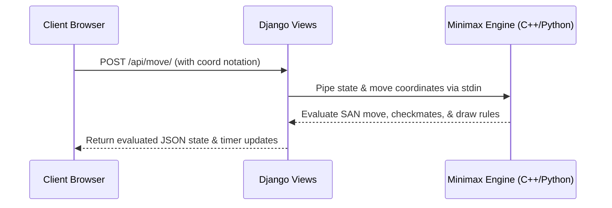

# Checkora REST API Developer Walkthrough

This document provides developers with a step-by-step walkthrough of the Checkora REST API. It outlines the core endpoints, payload structures, session state restoration, and offline diagnostics utilities.

---

## 🗺️ API Architecture & Flow Overview

Checkora leverages a **hybrid chess architecture**:
1. The **Frontend (Vanilla Javascript + HTML/CSS)** sends user moves to the Django REST endpoints.
2. The **Django Backend** routes the moves to the **C++ Chess Engine** process (or its pure-Python fallback script) via standard input/output streams.
3. The calculated move evaluations and game status flags are returned in JSON format to the client, synchronizing the interactive UI.



---

## 🛠️ Offline Developer Diagnostics

Before integrating with the API, developers can inspect their local environments, virtual environments, compiled engines, and opening books by running:

```bash
python manage.py validate_env
```

This diagnostic utility returns instantaneous status indicators for:
- Python Version (must be $\ge 3.12$)
- Presence of `.env` configurations
- Path checks and execution permissions for the compiled chess engine binary (`game/engine/main.exe` or `game/engine/main`)
- Database migrations integrity
- Validity of `book.json` opening candidate entries

---

## 🔗 Key REST Endpoints & Play Scenarios

### 1. Initializing a Match (`POST /api/new-game/`)
Resets the player's active session state and sets up a clean board.

- **Payload Structure**:
  ```json
  {
    "mode": "ai",
    "color": "white",
    "difficulty": "medium",
    "timer_mins": 10
  }
  ```
- **Response Mapping**:
  ```json
  {
    "board": [
      ["r", "n", "b", "q", "k", "b", "n", "r"],
      ["p", "p", "p", "p", "p", "p", "p", "p"],
      [null, null, null, null, null, null, null, null]
    ],
    "current_turn": "white",
    "move_history": [],
    "captured_pieces": {"white": [], "black": []},
    "mode": "ai"
  }
  ```

### 2. Dispatching a Move (`POST /api/move/`)
Sends a move to the backend to validate and execute.

- **Payload Structure**:
  ```json
  {
    "from_row": 6,
    "from_col": 4,
    "to_row": 4,
    "to_col": 4,
    "promotion_piece": null
  }
  ```
- **Response Mapping**:
  ```json
  {
    "valid": true,
    "board": [ ... ],
    "current_turn": "black",
    "captured": null,
    "game_status": "active",
    "move_history": [
      {
        "notation": "e4",
        "from": [6, 4],
        "to": [4, 4],
        "piece": "P",
        "color": "white"
      }
    ]
  }
  ```

### 3. Polling AI Countermoves (`POST /api/ai-move/`)
Triggered automatically by the frontend after a player's move completes in `Play vs AI` mode.

- **Response Mapping**:
  ```json
  {
    "valid": true,
    "board": [ ... ],
    "current_turn": "white",
    "ai_move": {
      "from_row": 1,
      "from_col": 4,
      "to_row": 3,
      "to_col": 4
    },
    "move_history": [
      {
        "notation": "e4", "from": [6, 4], "to": [4, 4], "piece": "P", "color": "white"
      },
      {
        "notation": "e5", "from": [1, 4], "to": [3, 4], "piece": "p", "color": "black"
      }
    ],
    "game_status": "active"
  }
  ```

---

## 🔒 Security Requirements & Headers

Except for `/api/pause/` (which supports fast beacon cleanup), **every state-modifying POST request must provide the Django CSRF validation token**.

### Extracting CSRF via Javascript
```javascript
const csrfToken = document.querySelector('[name=csrfmiddlewaretoken]').value;

const response = await fetch('/api/move/', {
    method: 'POST',
    headers: {
        'Content-Type': 'application/json',
        'X-CSRFToken': csrfToken
    },
    body: JSON.stringify(moveData)
});
```

---

## 🧩 Troubleshooting API Integration Problems

1. **403 Forbidden Error on POSTs**:
   - *Cause*: Missing `X-CSRFToken` in request headers.
   - *Fix*: Extract the token from the DOM cookie or input elements and bind it to the fetch headers map.
2. **Move validation hangs indefinitely**:
   - *Cause*: The backend C++ engine binary was built but crashed due to execution mismatches, or the Python fallback is loop-blocked.
   - *Fix*: Run `python manage.py validate_env` to verify executable permissions.
